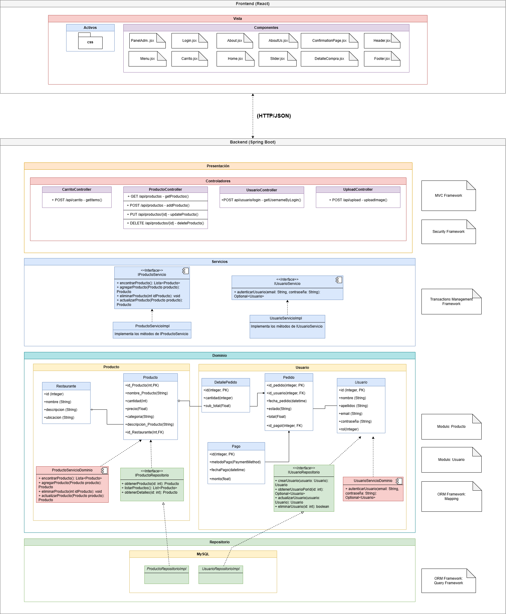

# Sistema de Integración de Cafeterías con Mayor Demanda de la UNMSM  

## 📌 Curso: Taller de Construcción de Software Web  

## 👨‍💻 Autores  
- **Fredy Anthony Huerta Firma**  
- **Leonardo David Baca Carretero**  
- **Triveño Ruffner Daniel**  
- **Joseph Rodolfo Flores Hilario**  
- **Jhon Bryan Gonzalez Villalobos**  
- **Pablo Francisco Guerra Camana**  
- **Leonardo Franco Ormeño Vasquez**  
- **Germán Callupe Huamán**

## 🎯 Propósito del Proyecto  
Este sistema tiene como objetivo integrar y mejorar la gestión de pedidos en las cafeterías con mayor demanda de la **Universidad Nacional Mayor de San Marcos (UNMSM)**.  
Se busca optimizar la experiencia del usuario, reducir tiempos de espera y facilitar el acceso a productos mediante una plataforma eficiente y escalable.  

## 🏗️ Vista General de la Arquitectura  
A continuación, se presenta la arquitectura general del sistema:  

  
  
## Principales servicios REST y funcionalidades

- Módulo: Gestión de Productos
  - Operaciones disponibles:
    
    
    
    

  - Entidad Clave:
    - Producto
    
      

- Módulo: Gestión de Usuarios
  - Operaciones disponibles:
 
    

  - Entidad Clave:
    - Usuario

    

## Prácticas de Desarrollo
El proyecto sigue buenas prácticas de desarrollo para garantizar calidad y mantenibilidad:
- Construcción Automática: Uso de Maven para la gestión de dependencias y construcción.

   

- Análisis Estático: Integración de herramientas como SonarQube para identificar problemas en el código.

  

- Pruebas Unitarias: Implementación de pruebas con JUnit.

  

Ejemplo de prueba unitaria con JUnit:

- Pruebas de APIs: Validación de endpoints con Postman

Pruebas APIs Postman

 - Gestion de Productos

  - Gestion de Usuarios

## Pipeline de CI/CD en Jenkins
El proyecto implementa un pipeline de CI/CD con las siguientes etapas:
- Construcción Automática: Compilación del código con Maven.

- Análisis Estático: Evaluación del código con SonarQube.
  
- Pruebas Unitarias: Ejecución de pruebas con JUnit.

- Pruebas de APIs: Verificación de endpoints REST con herramientas automatizadas.

## CONFIGURACIÓN DEL PIPELINE EN JENKINS
El siguiente es un Jenkinsfile que define el pipeline del proyecto. Este archivo automatiza varias etapas del proceso de integración continua, que incluyen la construcción del proyecto, la ejecución de pruebas y la implementación de medidas de seguridad y rendimiento.

    agent any

    tools {
        jdk 'JAVA'
        maven 'maven'
        nodejs 'NodeJS'
    }
    
    environment {
        SCANNER_HOME = tool 'sonar-scanner'
    }
    
    stages {
        stage("Checkout Código") {
            steps {
                git branch: 'master', 
                    changelog: false,
                    poll: false, 
                    url: 'https://github.com/PabloGC1908/SM-Taste.git'
            }
        }
        
        stage("Build y Pruebas Unitarias") {
            steps {
                dir('Backend') {  
                    bat "mvn clean test"  
                }
            }
        }
        
        stage("Prueba API - Productos") {
            steps {
                script {
                    bat "npm install -g newman"  
                    bat "newman run Backend/src/test/PruebasAPI/GestionProductos.json"
                }
            }
        }

        stage("Prueba API - Usuarios") {
            steps {
                bat "newman run Backend/src/test/PruebasAPI/GestionUsuarios.json"
            }
        }
        
        stage("SonarQube Analysis ") {
            steps {
                bat "$SCANNER_HOME/bin/sonar-scanner -Dsonar.url=http://localhost:9000/ \
                -Dsonar.login=sqp_bf41f219d26aff4d501bcfe1870605897b117b45 \
                -Dsonar.projectKey=Proyecto_TallerWeb \
                -Dsonar.projectName=Proyecto_TallerWeb \
                -Dsonar.sources=. \
                -Dsonar.java.binaries=. "
                }
            }
        
    } // End of stages

1. Definición del Pipeline

- Define un pipeline declarativo.
- Usa agent any, lo que significa que puede ejecutarse en cualquier nodo de Jenkins disponible.

2. Configuración de Herramientas

- Declara herramientas que Jenkins usará:
    - jdk 'JAVA': Configura el JDK (Java Development Kit).
    - maven 'maven': Usa Maven para la compilación y pruebas.
    - nodejs 'NodeJS': Usa Node.js, necesario para ejecutar scripts en JavaScript.

3. Definición de Variables de Entorno

Configura SCANNER_HOME como la ruta donde está instalado SonarQube Scanner.

4. Definición de Etapas (stages)

El código define diferentes stages (etapas) para gestionar el ciclo de vida del software.
4.1.  Checkout del Código Fuente

- Descarga el código desde GitHub (rama master).
- No mantiene historial de cambios (changelog: false).
- No activa construcción automática si hay cambios (poll: false).

4.2. Compilación y Pruebas Unitarias

- Entra a la carpeta Backend.
- Ejecuta:
    - mvn clean test: Limpia archivos temporales y ejecuta pruebas unitarias con Maven
 
4.3. Pruebas de API - Productos

- Instala Newman (npm install -g newman), una herramienta para ejecutar pruebas de Postman.
- Ejecuta pruebas de API para productos con el archivo JSON de pruebas.

4.4. Pruebas de API - Usuarios

Ejecuta pruebas de API para usuarios usando Newman.

4.5. Análisis de Código con SonarQube

- Usa SonarQube para analizar la calidad del código.
- Se conecta al servidor en http://localhost:9000/.
- Utiliza un token de autenticación (sonar.login).
- Especifica el nombre (Proyecto_TallerWeb) y los archivos a analizar.

En resumen este pipeline en Jenkins automatiza los siguientes pasos:

- Descarga el código desde GitHub.
- Compila y ejecuta pruebas unitarias con Maven.
- Ejecuta pruebas de API usando Newman.
- Analiza el código con SonarQube.
    

